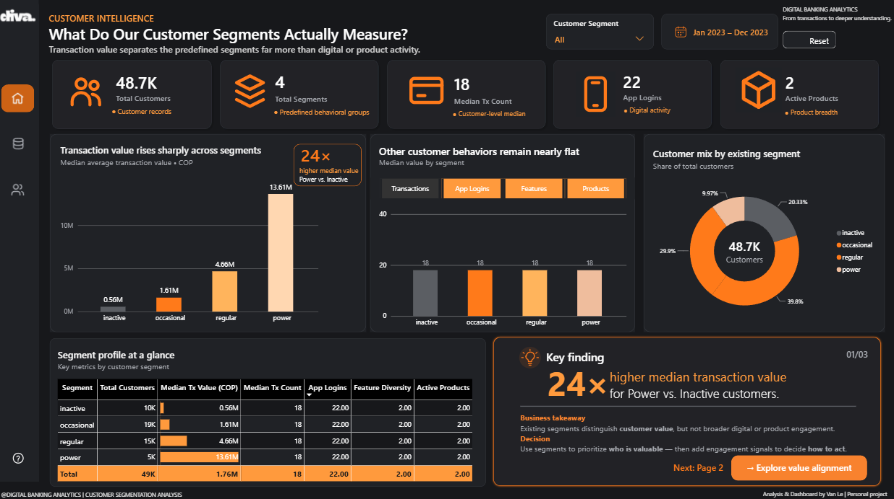
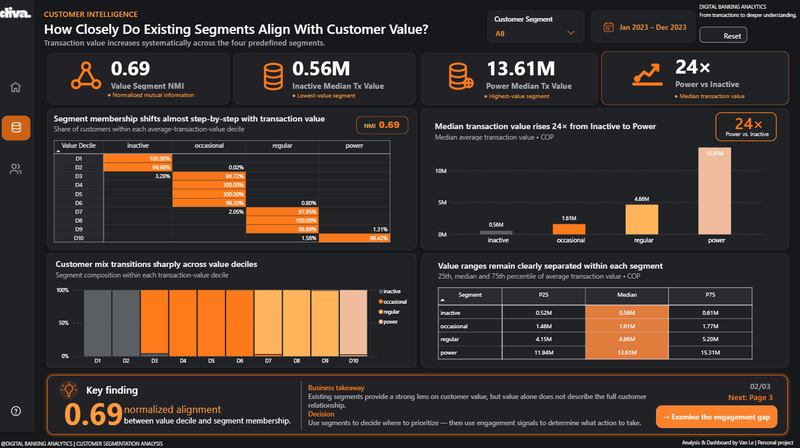
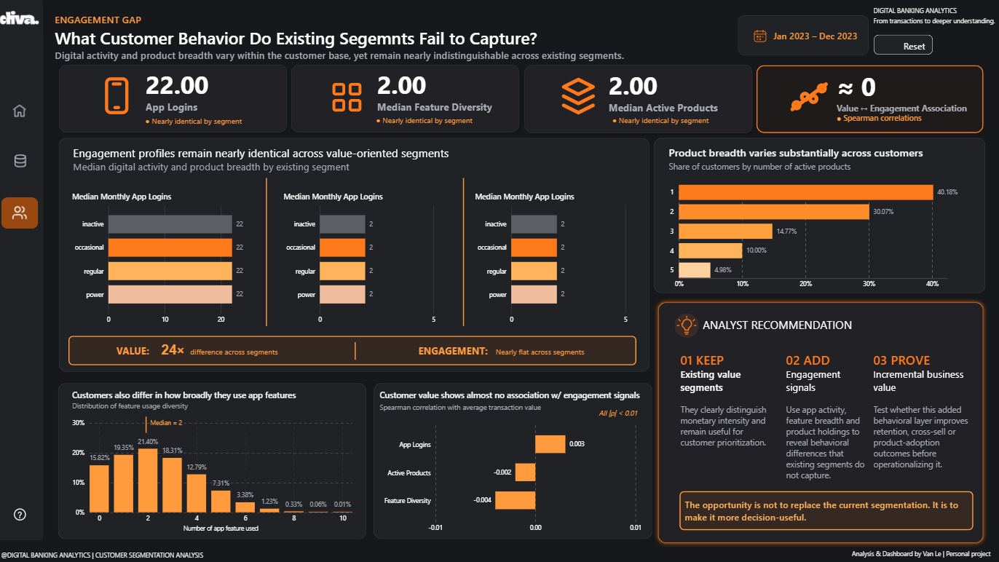

# Digital Banking Segmentation Audit

### What do customer segments actually measure?

A customer analytics project examining whether predefined digital banking segments reflect **monetary value, transaction behavior, or digital engagement**.

The audit found a clear split: customer segments align strongly with transaction value, while app activity, feature usage, and product breadth remain nearly unchanged across groups.

**Python · Pandas · Statistical Analysis · Power BI**

---

## Project Snapshot

| 48,723 | 3,159,157 | 24× | 0.69 | < 0.01 |
|:---:|:---:|:---:|:---:|:---:|
| Customers | Transactions | Median value gap | Value-segment NMI | Value-engagement \|ρ\| |

**Data period:** January–December 2023  
**Market:** Colombia  
**Currency:** COP  
**Dataset:** COFINFAD

---

## The Question

The dataset provides four predefined customer segments:

`Inactive` · `Occasional` · `Regular` · `Power`

I initially expected these groups to differ across several dimensions of customer behavior.

The first comparisons suggested something much narrower.

Transaction value changed dramatically across segments, while app logins, feature usage, active products, and transaction frequency barely moved.

That changed the question from:

> **How are these customer segments different?**

to:

> **What dimension of customer behavior do these segments actually appear to capture?**

---

## 01 · Segment Audit



The strongest separation appears in monetary activity.

Median average transaction value increases from approximately **0.56M COP** for Inactive customers to **13.61M COP** for Power customers.

That is roughly a **24× difference**.

Meanwhile, the typical customer across all four segments remains close to:

| Behavior | Typical value |
|---|---:|
| Transaction count | 18 |
| Monthly app logins | 22 |
| Feature diversity | 2 |
| Active products | 2 |

**Finding:** the supplied segmentation distinguishes monetary intensity much more clearly than observed digital or product engagement.

---

## 02 · Value Alignment



To check whether the pattern was limited to four segment medians, I divided customers into transaction-value deciles and compared segment composition across the distribution.

The transition is unusually clear:

- lower-value deciles are dominated by **Inactive** customers
- middle deciles move through **Occasional** and **Regular**
- the highest-value decile is overwhelmingly **Power**

Normalized mutual information between transaction-value decile and supplied segment membership:

### NMI = 0.69

This provides strong evidence that segment membership is closely aligned with monetary intensity.

It does **not** establish how the original segmentation algorithm was constructed because that methodology is not disclosed.

---

## 03 · Engagement Gap



Customers still vary meaningfully in how they use the platform.

- Active products range from **1 to 5**
- Feature usage diversity ranges from **0 to 10**
- App activity varies substantially across individual customers

Those differences simply do not appear to be captured strongly by the existing segment labels.

I tested the association between average transaction value and three engagement signals using Spearman correlation:

| Engagement signal | Spearman ρ |
|---|---:|
| App logins | +0.003 |
| Feature diversity | -0.004 |
| Active products | -0.002 |

All three relationships are effectively near zero.

**Interpretation:** monetary value and observed engagement behave like separate dimensions in this dataset.

---

## Analytical Workflow

```text
Raw customer + transaction data
            │
            ▼
      Data quality audit
            │
            ▼
 Transaction reconciliation
            │
            ▼
     Segment profiling
            │
            ▼
 Distribution + percentile analysis
            │
            ▼
   Value alignment analysis
            │
            ▼
    Engagement comparison
            │
            ▼
 Statistical association tests
            │
            ▼
       Power BI dashboard
            │
            ▼
    Business recommendation
```

---

## Data Validation

Before analyzing the supplied segmentation, I validated the analytical grain and rebuilt the primary transaction metrics from raw transaction history.

For each customer, I independently calculated:

```python
transaction_count
average_transaction_value
total_transaction_volume
first_transaction_date
last_transaction_date
```

The reconstructed values reconciled with the customer-level table across all **48,723 customers**.

Additional audit findings:

| Check | Result |
|---|---|
| Unique customer IDs | 48,723 / 48,723 |
| Customers represented in transactions | 100% |
| Orphan transaction customers | 0 |
| Transaction date coverage | Jan 4 – Dec 29, 2023 |
| Missing transaction fields | 0 |
| Exact duplicate transaction rows | 102 |
| Transaction ID available | No |

The 102 exact duplicate rows were **not automatically removed** because no transaction identifier is available to establish whether they represent duplicate records or legitimate repeated transactions.

---

## Statistical Approach

### Distribution-aware summaries

Transaction activity is heavily right-skewed, so the analysis emphasizes **medians and percentiles** instead of relying on means or deleting extreme observations by default.

### Spearman correlation

Spearman's rank correlation was used when examining relationships between monetary value and engagement variables because it does not require a linear relationship and is less sensitive to extreme values than Pearson correlation.

### Normalized Mutual Information

Normalized mutual information was used to quantify how closely transaction-value deciles align with the supplied categorical segment labels.

The resulting **NMI of 0.69** supports strong alignment without assuming that transaction value was explicitly used to create the original segments.

---

## An Analytical Choice I Did Not Make

I considered combining app activity, feature diversity, and product holdings into a single **engagement score**.

I decided against it.

The signals were only weakly related to one another, and the dataset provides no defensible basis for assigning weights.

A composite score would make the analysis cleaner visually, but it would introduce assumptions that the data does not support.

The engagement measures are therefore kept separate.

---

## Recommendation

### Preserve value segmentation. Add a second behavioral lens.

| KEEP | ADD | PROVE |
|---|---|---|
| Existing value segments | Observed engagement signals | Incremental business value |
| Use the current groups to identify customers with different levels of monetary activity. | Layer in app activity, feature usage, and product holdings when the decision depends on customer behavior. | Test whether the behavioral layer improves observed retention, cross-sell, or product-adoption outcomes before operationalizing it. |

The opportunity is not to replace the existing segmentation.

**It is to make it more decision-useful.**

---

## What the Data Does Not Tell Us

This project supports the conclusion that the supplied segments **align closely with monetary value**.

It does not establish:

- how the original segmentation methodology was constructed
- whether transaction value was explicitly used to create the labels
- whether engagement-based targeting improves retention or conversion
- causal relationships between customer behavior and business outcomes

The dataset also contains modeled fields such as churn probability and estimated customer lifetime value. I did not use these as independent validation outcomes because they are derived measures rather than observed customer outcomes.

One additional limitation: the supplied `active_products` field does not fully reconcile with the five visible product indicator fields. I therefore use the documented aggregate cautiously rather than reconstructing an unsupported definition.

---

## Repository Structure

```text
digital-banking-segmentation-audit/
│
├── data/
│   └── data_source.md
│
├── notebooks/
│   ├── 01_segment_discovery.ipynb
│   └── 02_engagement_gap.ipynb
│
├── visuals/
│   ├── 01_segment_audit.png
│   ├── 02_value_alignment.png
│   └── 03_engagement_gap.png
│
├── .gitignore
├── LICENSE
└── README.md
```

### `01_segment_discovery.ipynb`

Covers:

- dataset loading and validation
- customer-level data audit
- segment distribution
- transaction behavior by segment
- engagement comparisons
- value-decile construction
- normalized mutual information

### `02_engagement_gap.ipynb`

Covers:

- engagement distributions
- product breadth
- feature usage diversity
- value-engagement relationships
- Spearman correlation analysis
- validation of the engagement-gap finding

---

## Tools & Methods

<table>
<tr>
<td valign="top" width="33%">

### Analysis

Python  
Pandas  
NumPy  

</td>
<td valign="top" width="33%">

### Statistics

Distribution analysis  
Percentiles  
Spearman correlation  
Normalized mutual information  

</td>
<td valign="top" width="33%">

### Visualization

Power BI  
DAX  
Dashboard design  

</td>
</tr>
</table>

---

## Data Source

This project uses the **COFINFAD Colombian Fintech Financial Analytics Dataset**, an anonymized digital banking dataset covering customer and transaction activity during 2023.

The working dataset contains:

- **48,723 customers**
- **3,159,157 transactions**
- customer demographics and acquisition information
- transaction history
- product usage
- digital activity
- satisfaction and support variables

Raw data is not redistributed in this repository.

Full provenance, field notes, licensing information, and known limitations are documented in:

[`data/data_source.md`](data/data_source.md)

---

## Reproducing the Analysis

1. Obtain the COFINFAD source files described in [`data/data_source.md`](data/data_source.md).
2. Place `customer_data.csv` and `transactions_data.csv` in your local raw-data directory.
3. Update the data path at the beginning of each notebook.
4. Run [`01_segment_discovery.ipynb`](notebooks/01_segment_discovery.ipynb).
5. Run [`02_engagement_gap.ipynb`](notebooks/02_engagement_gap.ipynb).

The notebooks intentionally separate exploratory segment analysis from the engagement-gap validation so the analytical progression remains easy to inspect.

---

## Key Takeaway

> **Customer value is not the same as customer engagement.**

The supplied segmentation provides a useful view of monetary intensity, but customers with similar value labels can still differ in how broadly and actively they use the platform.

For decisions that depend on customer behavior, value segmentation should be treated as one analytical layer rather than the complete customer picture.
